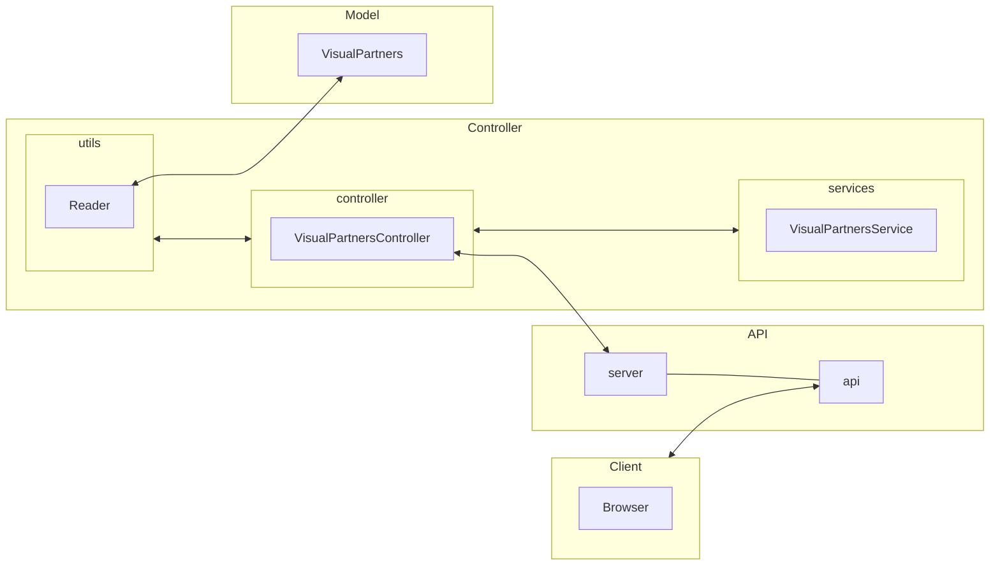

# Visual Partner-ship - Code challenge

## Table of Contents
1. [General Info](#general-info)   
   - Description
   - Requirements
   - API Design System  
2. [Getting started](#getting-started)
   - Pre-requisites
   - Installation
3. [Technolgies](#technolgies)
4. [Test Executing](#test-executing)
   - Automated tests
   - Unit tests
5. [Functionality](#functionality)
   - GET endpoint: Getting list of students
   - GET endpoint: Getting email's students which are certificated
   - GET endpoint: Getting students with credits higher of 500.
6. [Authors](#authors)
7. [Acknowledgements](#acknowledgements)

### General Info
***

#### Description
This documment explains how to build and consult a simple Web API application using a Visual Partners **[source data](https://gist.github.com/carlogilmar/1f5164637fb77aecef3b9e6b9e2a9b63)** which has simple information based on a MVC design pattern.   

#### Requirements
To make this API, you need to accomplish these requirements:
  - Enable an endpoint to get a students list with his fields.
  - Enable an endpoint to get student's emails that have a certification.
  - Enable an endpoint to get students with 500 or more credits.

#### API Design System
The following flowchart shows how this project was designed, considering SoD (Separation of dutties).

Taking a look at the last flowchart, this was designed on a Model-View-Controller paradigm, considering that each component has its own functions.

   1. **Model**: As mentioned at the beginning of this section, the json file of VisualPartners will be the data source, stored on a array format.
   2. **Controller**: In this part, it was recommended to design under three important elements, to mantain a better modularity:
      - **Utils/Reader**: this component reads the source data, bringing it as a JSON object type.
      - **Services/VisualPartnerService**: it works like an extension of controller, providing only the logic functions that will manipulate the information stored on the model.
      - **controller/VisualPartnersController** it will manage the requests from the client and the responses of data manipulation that will be return to the API.
   3. **API**: it will host the server functionalities and the API with the parsed data.